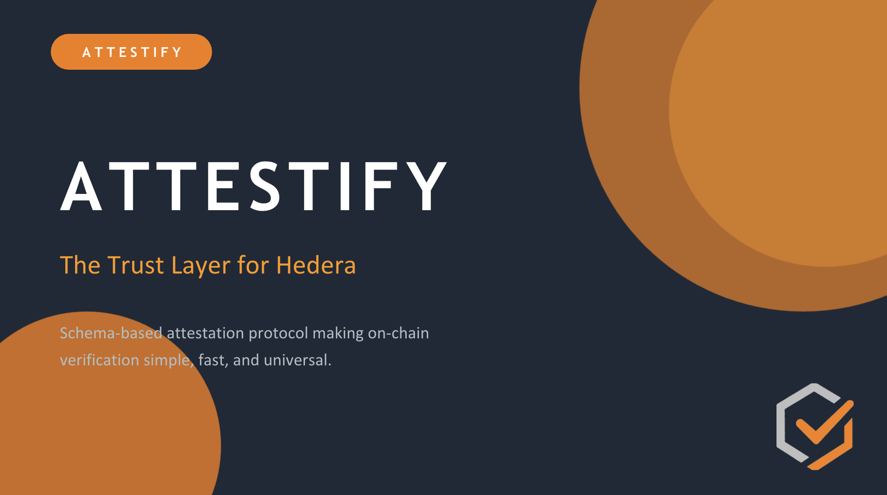
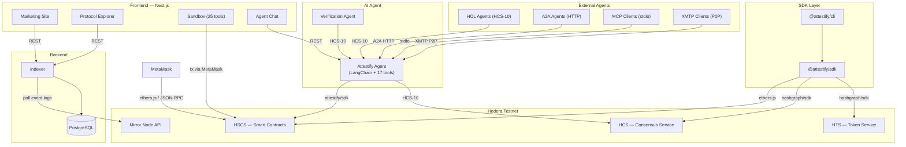

<p align="center">
  
</p>

<h1 align="center">Attestify</h1>

<p align="center">
  <strong>The trust layer for Hedera.</strong><br/>
  On-chain proof, no coding required.<br/>
  A schema-based attestation protocol for issuing, managing, and verifying on-chain claims with sub-second finality and predictable low fees.
</p>

<p align="center">
  <a href="https://attestify-web.vercel.app/">Website</a> ·
  <a href="https://attestify-web.vercel.app/sandbox/app">Sandbox</a> ·
  <a href="https://www.npmjs.com/package/@attestify/sdk">SDK</a> ·
  <a href="https://www.npmjs.com/package/@attestify/cli">CLI</a> ·
  <a href="https://github.com/Aliyaan-Nasir/Attestify">GitHub</a>
</p>

<p align="center">
  <a href="https://www.npmjs.com/package/@attestify/sdk"></a>
  <a href="https://www.npmjs.com/package/@attestify/cli"></a>
  <a href="https://github.com/Aliyaan-Nasir/Attestify"></a>
  <a href="https://hedera.com/hackathon"></a>
  
  
</p>

---

<p align="center">
  <strong>Hackathon Submission:</strong> Hedera Hello Future Apex Hackathon 2026
</p>

<table align="center">
  <tr>
    <th></th>
    <th>Main Track — <a href="#what-is-attestify">Open Track</a></th>
    <th>Bounty — <a href="bounty/README.md">HOL Registry</a></th>
  </tr>
  <tr>
    <td><strong>Pitch Deck</strong></td>
    <td><a href="https://drive.google.com/file/d/1GbmLk7AneLYSEIvVrU40UWismI8MWMKF/view?usp=sharing">Google Drive</a></td>
    <td><a href="https://drive.google.com/file/d/1Bksb8vH-yQ1KFyapNTp0uBd3BMpgFVl9/view?usp=drive_link">Google Drive</a></td>
  </tr>
  <tr>
    <td><strong>Demo Video</strong></td>
    <td><a href="https://youtu.be/lfaA0AqRfG4">YouTube</a></td>
    <td><a href="https://youtu.be/jNkgMh1SDPs?si=utGIgUOc12F6eXhs">YouTube</a></td>
  </tr>
</table>

---

## What is Attestify?

On-chain identity and verification is one of the biggest barriers to Web3 adoption. Developers spend weeks writing custom smart contracts for basic verification use cases. Existing attestation frameworks are complex, expensive, and built for Ethereum — not optimized for Hedera's unique capabilities. ZK proofs add cryptographic complexity without clear business value for straightforward claims. Enterprise teams can't justify months of integration work for what should be a simple operation: proving something about someone, on-chain.

Attestify solves this. It's a schema-based attestation protocol built natively on Hedera that makes on-chain verification as simple as defining what you want to verify. No Solidity expertise required. No custom contracts to write, audit, or maintain. Define a schema, issue an attestation, verify it — all with sub-second finality and predictable fees under $0.001 per transaction.

Instead of writing custom smart contracts for every verification use case, developers define what they want to verify using simple schema definitions, and Attestify handles the blockchain complexity.

```typescript
import { HederaAttestService, SchemaEncoder } from '@attestify/sdk';

// Define what you want to verify
const { data: schema } = await service.registerSchema({
  definition: 'string name, uint8 level, bool verified',
  revocable: true,
});

// Issue a verifiable claim
const encoder = new SchemaEncoder('string name, uint8 level, bool verified');
const { data } = await service.createAttestation({
  schemaUid: schema.schemaUid,
  subject: '0x1234...5678',
  data: encoder.encode({ name: 'Alice', level: 2, verified: true }),
});

// Anyone can verify — one line
const { data: record } = await service.getAttestation(data.attestationUid);
console.log(record.revoked ? 'Revoked' : 'Active');
```

Three lines to register a schema. Three lines to issue an attestation. One line to verify.

> **By the numbers:** 7 contracts · 50+ SDK methods · 40+ CLI commands · 10 API endpoints · 25 sandbox tools · 17 agent tools · 5 protocols · 2 HOL agents · 3 HCS topics

### Core Concepts

- **Schemas** — Reusable templates defining attestation data structure (e.g., `string name, uint256 age, bool verified`). Register once, use across any application. Deterministic UIDs.
- **Attestations** — On-chain claims by an attester about a subject, structured according to a schema. ABI-encoded data, immutable records, optional expiration and revocation.
- **Authorities** — Registered entities that issue attestations. Can be verified by protocol governance. Supports delegation for employees, AI agents, and automated systems.
- **Resolvers** — Optional smart contracts for custom validation: whitelist access control, HBAR fee collection, HTS token gating, token rewards, or chained multi-resolver pipelines.

### Use Cases

- **KYC Verification** — On-chain identity attestations for DeFi. One attestation, verified everywhere.
- **Developer Reputation** — GitHub contribution proof on-chain. Verifiable developer CVs without resumes.
- **Asset Certification** — Tokenized asset provenance. Immutable chain for auditors and buyers.
- **DAO Governance** — Revocable membership attestations for on-chain voting eligibility.
- **Event Attendance** — Permanent, verifiable proof of participation. No PDFs, no emails.

---

## Hedera Services Used

Attestify isn't a generic EVM dApp that happens to run on Hedera. It leverages 7 distinct Hedera-native services:

| Service | How Attestify Uses It |
|---------|----------------------|
| **HSCS (Smart Contracts)** | SchemaRegistry + AttestationService + 5 resolver contracts. EVM compatibility with sub-second finality and ~$0.0001/tx. |
| **HCS (Consensus Service)** | Immutable audit trail — 3 global topics + per-schema topics with consensus timestamps. HCS-10 for agent-to-agent communication. HCS-11 for agent profiles. |
| **HTS (Token Service)** | Token-gated attestations, NFT credential minting, authority staking (Bronze/Silver/Gold tiers), token rewards for attestation subjects. |
| **Scheduled Transactions** | Automatic attestation revocations at a future time — no cron jobs, no keeper networks. |
| **Threshold Keys** | Native multi-sig authorities (e.g., 2-of-3) without deploying a multi-sig contract. |
| **File Service** | Large schema storage on-chain for complex definitions (50+ fields). |
| **Mirror Node** | Event indexing for the Explorer and API — full history with consensus timestamps. |

---

## What We Built

### 1. Smart Contracts (Solidity on HSCS)

7 contracts deployed on Hedera Testnet:

| Contract | Role |
|----------|------|
| SchemaRegistry | Schema registration with deterministic UIDs, resolver validation |
| AttestationService | Full attestation lifecycle, authority management, delegation, resolver hooks |
| WhitelistResolver | Only pre-approved addresses can attest |
| FeeResolver | Requires HBAR deposit before attesting |
| TokenGatedResolver | Requires minimum HTS token balance |
| TokenRewardResolver | Distributes HTS tokens to attestation subjects |
| CrossContractResolver | Chains multiple resolvers in a sequential pipeline |

### 2. TypeScript SDK ([`@attestify/sdk`](https://www.npmjs.com/package/@attestify/sdk))

- `HederaAttestService` — 50+ methods covering every protocol operation
- `SchemaEncoder` — ABI encode/decode attestation data with type coercion and validation
- `HCSLogger` — Audit trail publishing to HCS topics
- `IndexerClient` — Query indexed data without a private key
- `computeSchemaUid()` / `computeAttestationUid()` — Deterministic UID computation
- `mintAttestationNFT()` — HTS NFT credential minting
- Zero-throw design — every method returns `ServiceResponse<T>` with 11 typed error categories
- `@attestify/sdk/ai` — Optional AI entry point: `getAttestifyTools(config)` returns 17 LangChain-compatible tools, `createAttestifyAgent(config)` returns a ready-to-use agent with conversation memory

### 3. CLI ([`@attestify/cli`](https://www.npmjs.com/package/@attestify/cli))

40+ commands covering schemas, attestations, authorities, delegation, resolvers, HCS audit log, scheduled revocations, multi-sig, staking, and file service. `--json` flag on every command for machine-readable output. Includes `attestify ai` for natural language interaction — one-shot mode or interactive REPL.

### 4. Mirror Node Indexer

Express.js backend polling Hedera Mirror Node for contract events. PostgreSQL via Prisma ORM. REST API with 10 endpoints. HCS Publisher with retry logic and per-schema topic creation. Automatic data backfill from contracts.

### 5. Next.js Frontend

- **Marketing Site** — Landing page with interactive code examples, product pages, about page with roadmap
- **Protocol Explorer** — Browse schemas, attestations, and authorities with decoded data. HCS Audit Trail section on every detail page with clickable HashScan links.
- **Interactive Sandbox** — 25 wallet-connected tools in 6 categories:
  - Core Workflows (5): Schema Deployer, Attestation Workflow, Revoke, Register Authority, Verify Authority
  - Delegation (2): Delegated Attestation, Delegated Revocation
  - Resolver Tools (5): Whitelist Manager, Fee Resolver, Token Gated, Token Reward, Cross-Contract
  - Data Tools (4): Schema Encoder/Decoder, Wallet Attestations, Wallet Schemas, Schema Attestations
  - Retrieval (2): Lookup Attestation, Universal Search
  - Hedera Native (6): Verify HCS Proof, HTS NFT Credential, Scheduled Revocation, Multi-Sig Authority, Token Staking, File Service Schema
- **Agent Chat** — AI-powered natural language interface to the protocol. Connected to `@attestify/sdk` via 17 LangChain tools — interact with the full Attestify protocol using plain English instead of forms and flags.
- **My Profile** — Wallet-gated dashboard showing authority status, schemas, attestations, HCS topic links
- **Docs Page** — Full SDK and CLI reference with interactive code examples

### 6. AI Agent (`@attestify/agent`)

A LangChain-powered AI agent with 17 tools wrapping `@attestify/sdk`. Registered in the [HOL Registry](https://hol.org/registry) with HCS-11 profile. Supports 5 communication protocols:

| Protocol | Transport | Use Case |
|----------|-----------|----------|
| HCS-10 | Hedera Consensus Service | HOL Registry agents, Hedera-native A2A |
| A2A (Google) | HTTP JSON-RPC | OpenClaw, CrewAI, any A2A-compatible agent |
| MCP | stdio JSON-RPC | Claude, Cursor, Kiro, any MCP client |
| XMTP | P2P messaging | Web3 wallets, Converse app |
| REST API | HTTP | Frontend Agent Chat UI |

**17 Agent Tools:**

| Category | Tools |
|----------|-------|
| Schemas | `register_schema`, `get_schema`, `list_schemas` |
| Attestations | `create_attestation`, `get_attestation`, `revoke_attestation`, `list_attestations` |
| Authorities | `register_authority`, `get_authority`, `get_profile` |
| Data Encoding | `encode_attestation_data`, `decode_attestation_data` |
| Resolvers | `whitelist_check`, `fee_get_fee`, `fee_get_balance` |
| Hedera Native | `mint_nft_credential`, `schedule_revocation` |

**Full bounty README:** [`bounty/README.md`](bounty/README.md)

---

## Architecture



---

## On-Chain Contracts & Topics

| Asset | Address / ID | Verify |
|-------|-------------|--------|
| SchemaRegistry | `0x8320Ae819556C449825F8255e92E7e1bc06c2e80` | [HashScan](https://hashscan.io/testnet/contract/0x8320Ae819556C449825F8255e92E7e1bc06c2e80) |
| AttestationService | `0xce573F82e73F49721255088C7b4D849ad0F64331` | [HashScan](https://hashscan.io/testnet/contract/0xce573F82e73F49721255088C7b4D849ad0F64331) |
| WhitelistResolver | `0x461349A8aEfB220A48b61923095DfF237465c27A` | [HashScan](https://hashscan.io/testnet/contract/0x461349A8aEfB220A48b61923095DfF237465c27A) |
| FeeResolver | `0x7460B74e14d17f0f852959D69Db3F1EAE72aF37C` | [HashScan](https://hashscan.io/testnet/contract/0x7460B74e14d17f0f852959D69Db3F1EAE72aF37C) |
| TokenGatedResolver | `0x7d04a83cF73CD4853dB4E378DD127440d444718c` | [HashScan](https://hashscan.io/testnet/contract/0x7d04a83cF73CD4853dB4E378DD127440d444718c) |
| Schemas HCS Topic | `0.0.8221945` | [HashScan](https://hashscan.io/testnet/topic/0.0.8221945) |
| Attestations HCS Topic | `0.0.8221946` | [HashScan](https://hashscan.io/testnet/topic/0.0.8221946) |
| Authorities HCS Topic | `0.0.8221947` | [HashScan](https://hashscan.io/testnet/topic/0.0.8221947) |
| Attestify Agent | `0.0.7284771` | [HashScan](https://hashscan.io/testnet/account/0.0.7284771) |
| Verification Agent | `0.0.6362296` | [HashScan](https://hashscan.io/testnet/account/0.0.6362296) |
| Network | Hedera Testnet | — |

Per-schema HCS topics are automatically created when a schema is registered.

---

## Quick Start

### Prerequisites

- Node.js 20+
- pnpm 9+
- PostgreSQL (for the indexer)
- MetaMask browser extension (for the frontend sandbox)
- A Hedera testnet account ([portal.hedera.com](https://portal.hedera.com))
- An OpenAI API key (for the AI agent)

### Install

```bash
cd hedera
pnpm install
```

### Environment Variables

```bash
cp contracts/.env.example contracts/.env
cp apps/indexer/.env.example apps/indexer/.env
cp apps/web/.env.example apps/web/.env
cp bounty/agent/.env.example bounty/agent/.env
```

| Variable | Where | Description |
|----------|-------|-------------|
| `HEDERA_ACCOUNT_ID` | All | Hedera operator account (e.g. `0.0.12345`) |
| `HEDERA_PRIVATE_KEY` | All | ECDSA private key (hex, no `0x` prefix) |
| `DEPLOYER_PRIVATE_KEY` | Contracts | Same key, used by Hardhat |
| `OPENAI_API_KEY` | Agent | OpenAI API key for the LangChain agent |
| `INDEXER_URL` | Agent, Web | Indexer REST API URL (default: `http://localhost:3001/api`) |

### Compile & Deploy Contracts

```bash
pnpm --filter contracts exec hardhat compile
pnpm --filter contracts exec hardhat run scripts/deploy.ts --network hedera_testnet
```

### Run the Indexer

```bash
pnpm --filter @attestify/indexer prisma:generate
pnpm --filter @attestify/indexer prisma:migrate:dev
pnpm --filter @attestify/indexer dev
```

### Run the Frontend

```bash
pnpm --filter @attestify/web dev
```

Opens at [http://localhost:3000](http://localhost:3000).

### Run the AI Agent

```bash
pnpm --filter @attestify/agent start
```

Starts on port 3002 with REST API, A2A, HCS-10 listener, and XMTP (if configured).

For MCP (separate process):
```bash
pnpm --filter @attestify/agent mcp
```

### Build the SDK

```bash
pnpm --filter @attestify/sdk build
```

---

## SDK Quick Start

```typescript
import { HederaAttestService, SchemaEncoder } from '@attestify/sdk';

const service = new HederaAttestService({
  network: 'testnet',
  operatorAccountId: '0.0.xxxxx',
  operatorPrivateKey: 'your_key_hex',
  contractAddresses: {
    schemaRegistry: '0x8320Ae819556C449825F8255e92E7e1bc06c2e80',
    attestationService: '0xce573F82e73F49721255088C7b4D849ad0F64331',
  },
});

// Register a schema
const schema = await service.registerSchema({
  definition: 'string name, uint256 age, bool verified',
  revocable: true,
});

// Encode data
const encoder = new SchemaEncoder('string name, uint256 age, bool verified');
const encoded = encoder.encode({ name: 'Alice', age: 25, verified: true });

// Create an attestation
const attestation = await service.createAttestation({
  schemaUid: schema.data.schemaUid,
  subject: '0x...',
  data: encoded,
});

// Verify
const record = await service.getAttestation(attestation.data.attestationUid);
console.log(record.data.revoked ? 'Revoked' : 'Active');

// Revoke
await service.revokeAttestation(attestation.data.attestationUid);
```

---

## CLI Usage

```bash
export HEDERA_ACCOUNT_ID=0.0.xxxxx
export HEDERA_PRIVATE_KEY=your_key_hex

# Schemas
attestify schema create --definition "string name, uint256 age" --revocable
attestify schema fetch --uid 0x...
attestify schema list

# Attestations
attestify attestation create --schema-uid 0x... --subject 0x... --data "0x..."
attestify attestation fetch --uid 0x...
attestify attestation list --attester 0x...
attestify attestation revoke --uid 0x...

# Authorities
attestify authority register --metadata "My Organization"
attestify authority fetch --address 0x...
attestify authority verify --address 0x...

# HCS Audit Log
attestify hcs topics
attestify hcs messages --topic 0.0.12345

# Resolvers
attestify whitelist add --account 0x...
attestify whitelist check --account 0x...
attestify fee deposit --amount 10
attestify fee get-fee

# All commands support --json
attestify schema fetch --uid 0x... --json
```

---

## SDK AI Tools (`@attestify/sdk/ai`)

Build your own AI agent with 17 LangChain-compatible tools wrapping the full Attestify SDK:

```typescript
import { getAttestifyTools, createAttestifyAgent } from '@attestify/sdk/ai';

// Option 1: Get tools for your own agent
const tools = getAttestifyTools({
  accountId: '0.0.xxxxx',
  privateKey: 'your_key_hex',
  indexerUrl: 'http://localhost:3001/api',
});

// Option 2: Get a ready-to-use agent with conversation memory
const { processMessage } = await createAttestifyAgent({
  accountId: '0.0.xxxxx',
  privateKey: 'your_key_hex',
  openAIApiKey: 'sk-...',
});

const response = await processMessage('Register a KYC schema with name, documentType, verified');
```

---

## CLI AI Mode

Natural language interface to the protocol — same 17 tools, powered by `@attestify/sdk/ai`:

```bash
export OPENAI_API_KEY=sk-...

# One-shot mode
attestify ai "List all schemas"
attestify ai "Register a schema with fields: string name, uint256 age"

# Interactive REPL mode
attestify ai
# You: What schemas are registered?
# Agent: Found 3 schema(s): ...
# You: exit
```

---

## AI Agent Chat

```
You: "Register a KYC schema with fields name, documentType, verified"
Agent: "Schema registered! UID: 0x7408a93f..."

You: "Attest that 0x0F1A... passed KYC with name Alice, documentType Passport, verified true"
Agent: "Attestation created! UID: 0xbc72d396..."

You: "Show me all attestations for 0x0F1A..."
Agent: "Found 1 attestation(s): UID: 0xbc72d396... Status: Active"

You: "Revoke that attestation"
Agent: "Attestation revoked! UID: 0xbc72d396..."
```

---

## Monorepo Structure

```
hedera/
├── contracts/          Solidity smart contracts (Hardhat)
│   ├── contracts/
│   │   ├── SchemaRegistry.sol
│   │   ├── AttestationService.sol
│   │   ├── IResolver.sol
│   │   ├── resolvers/              WhitelistResolver, TokenGated, Fee, TokenReward, CrossContract
│   │   └── libraries/UIDGenerator.sol
│   ├── scripts/deploy.ts
│   └── test/
├── packages/
│   ├── sdk/            TypeScript SDK (@attestify/sdk)
│   │   ├── HederaAttestService.ts
│   │   ├── schema-encoder.ts
│   │   ├── uid.ts, hcs.ts, hts.ts
│   │   └── ai.ts                   SDK AI export (17 LangChain tools)
│   └── cli/            CLI tool (@attestify/cli)
│       └── src/index.ts
├── apps/
│   ├── web/            Next.js frontend (marketing + explorer + sandbox + agent chat)
│   │   └── src/app/
│   └── indexer/        Backend indexer (Express + Prisma + Mirror Node)
│       ├── src/
│       └── prisma/schema.prisma
└── bounty/
    └── agent/          AI Agent (@attestify/agent)
        └── src/
            ├── index.ts                Entry point (all protocols)
            ├── attestify-tools.ts      17 LangChain tools
            ├── agent.ts                LangChain agent + system prompt
            ├── hcs10-server.ts         HCS-10 listener
            ├── a2a-server.ts           Google A2A protocol
            ├── mcp-server.ts           MCP server (stdio)
            ├── xmtp-server.ts          XMTP adapter
            ├── register.ts             HOL Registry registration
            └── demos/                  Scripted protocol demos
```

---

## Testing

```bash
# All tests
pnpm test

# Per package
pnpm --filter contracts test
pnpm --filter @attestify/sdk test
pnpm --filter @attestify/cli test
pnpm --filter @attestify/indexer test
pnpm --filter @attestify/web test
```

---

## Live Deployments

| Service | URL | Platform |
|---------|-----|----------|
| Frontend | [attestify-web.vercel.app](https://attestify-web.vercel.app/) | Vercel |
| Indexer API | [attestify-production.up.railway.app](https://attestify-production.up.railway.app) | Railway |
| Agent API | [agent-production-f526.up.railway.app](https://agent-production-f526.up.railway.app) | Railway |
| A2A Agent Card | [/.well-known/agent.json](https://agent-production-f526.up.railway.app/.well-known/agent.json) | Railway |
| Agent Chat | [/sandbox/app/agent-chat](https://attestify-web.vercel.app/sandbox/app/agent-chat) | Vercel |
| Sandbox | [/sandbox/app](https://attestify-web.vercel.app/sandbox/app) | Vercel |

---

## npm Packages

| Package | Install |
|---------|---------|
| [`@attestify/sdk`](https://www.npmjs.com/package/@attestify/sdk) | `pnpm add @attestify/sdk` |
| [`@attestify/cli`](https://www.npmjs.com/package/@attestify/cli) | `pnpm add -g @attestify/cli` |

---

## Tech Stack

| Layer | Technology |
|-------|-----------|
| Smart Contracts | Solidity, Hardhat, ethers.js |
| SDK | TypeScript, ethers.js, @hashgraph/sdk |
| SDK AI | `@attestify/sdk/ai` — 17 LangChain tools + agent factory |
| CLI | Commander.js, `attestify ai` natural language mode |
| Indexer | Express.js, Prisma, PostgreSQL |
| Frontend | Next.js 15, React 19, Tailwind CSS, MetaMask |
| AI Agent | LangChain, @langchain/openai (gpt-4o-mini), @hashgraphonline/standards-sdk |
| Protocols | HCS-10, HCS-11, Google A2A, MCP, XMTP |
| Infra | Vercel, Railway, pnpm monorepo |

---

## Links

| Resource | URL |
|----------|-----|
| Website | [attestify-web.vercel.app](https://attestify-web.vercel.app/) |
| Agent Chat | [attestify-web.vercel.app/sandbox/app/agent-chat](https://attestify-web.vercel.app/sandbox/app/agent-chat) |
| GitHub | [github.com/Aliyaan-Nasir/Attestify](https://github.com/Aliyaan-Nasir/Attestify) |
| npm SDK | [npmjs.com/package/@attestify/sdk](https://www.npmjs.com/package/@attestify/sdk) |
| npm CLI | [npmjs.com/package/@attestify/cli](https://www.npmjs.com/package/@attestify/cli) |
| HOL Registry | [hol.org/registry](https://hol.org/registry) |
| Main Track Pitch | [Google Drive](https://drive.google.com/file/d/1GbmLk7AneLYSEIvVrU40UWismI8MWMKF/view?usp=sharing) |
| Main Track Demo | [YouTube](https://youtu.be/lfaA0AqRfG4) |
| Bounty Pitch | [Google Drive](https://drive.google.com/file/d/1Bksb8vH-yQ1KFyapNTp0uBd3BMpgFVl9/view?usp=drive_link) |
| Bounty Demo | [YouTube](https://youtu.be/jNkgMh1SDPs?si=utGIgUOc12F6eXhs) |
| Bounty README | [`bounty/README.md`](bounty/README.md) |

---

## License

MIT

---

<p align="center">
  Built by <strong>Aliyaan Nasir</strong> for the <a href="https://hedera.com/hackathon">Hedera Hello Future Apex Hackathon 2026</a>
</p>
