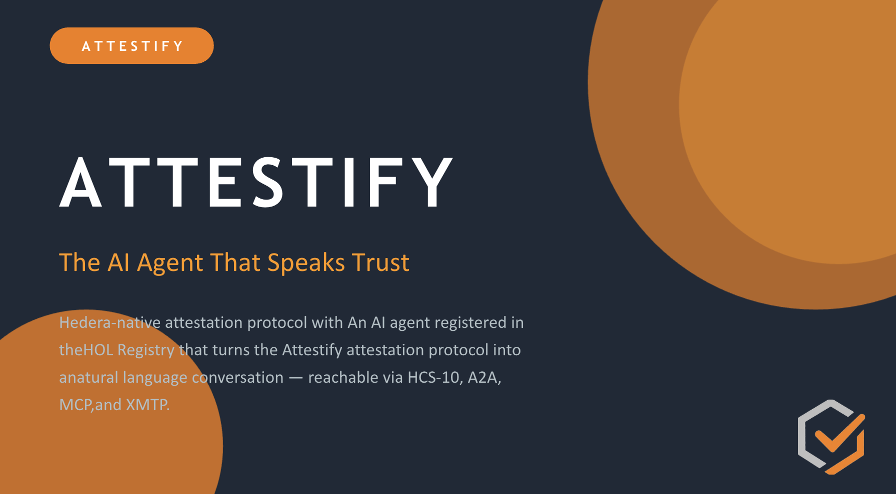
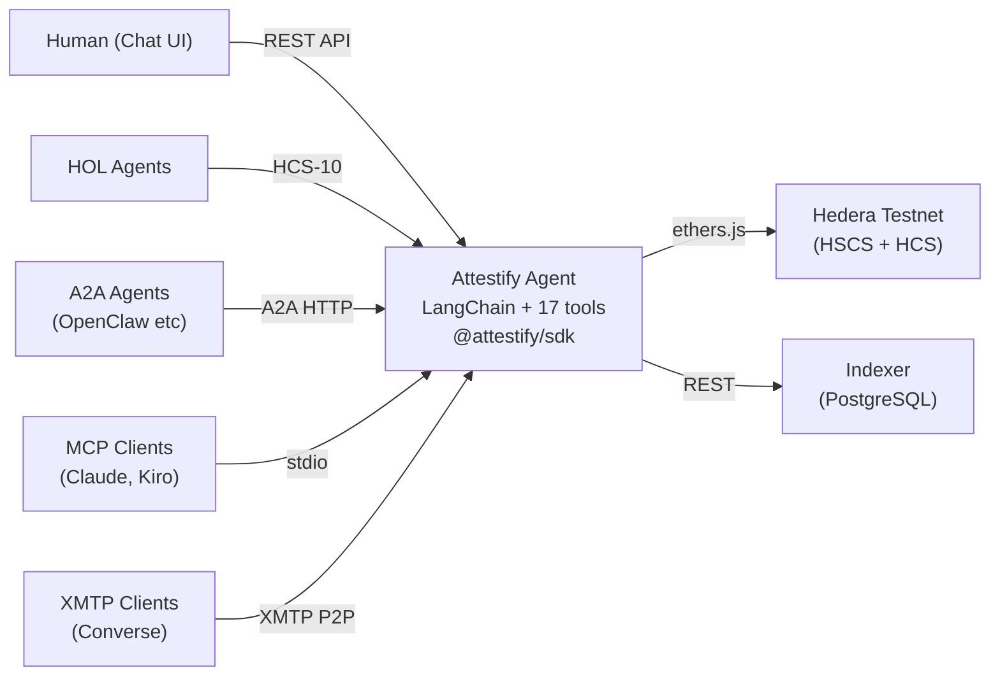
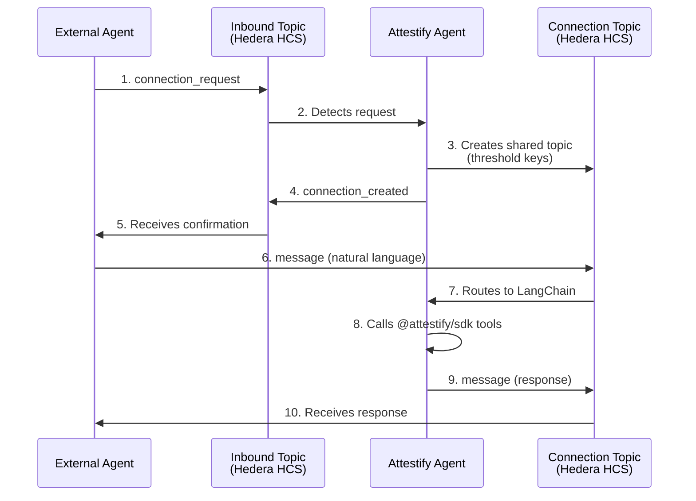
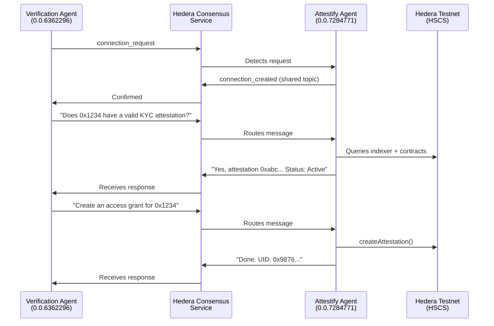

<p align="center">
  
</p>

# Attestify Agent — HOL Registry Bounty

**Hedera Hello Future Apex Hackathon 2026** · **Bounty: Hashgraph Online (HOL)**

An AI agent registered in the [HOL Registry](https://hol.org/registry) that turns the entire Attestify attestation protocol into a natural language conversation. Users and other agents connect via **HCS-10**, **A2A**, **MCP**, **XMTP**, or **REST** and interact with live smart contracts on Hedera through plain English.

> *"Register a KYC schema with fields name, documentType, verified"* → on-chain schema registration  
> *"Attest that 0x1234 passed verification"* → on-chain attestation with ABI-encoded data  
> *"Show me all attestations for this address"* → indexer query with formatted results

---

## Quick Links

| | Link |
|---|------|
| 🌐 Website | [attestify-web.vercel.app](https://attestify-web.vercel.app/) |
| 💬 Agent Chat | [attestify-web.vercel.app/sandbox/app/agent-chat](https://attestify-web.vercel.app/sandbox/app/agent-chat) |
| 📂 GitHub | [github.com/Aliyaan-Nasir/Attestify](https://github.com/Aliyaan-Nasir/Attestify) |
| 📊 Pitch Deck | [Google Drive](https://drive.google.com/file/d/1Bksb8vH-yQ1KFyapNTp0uBd3BMpgFVl9/view?usp=sharing) |
| 🎥 Demo Video | [YouTube](https://youtu.be/jNkgMh1SDPs?si=utGIgUOc12F6eXhs) |
| 📦 SDK (npm) | [@attestify/sdk](https://www.npmjs.com/package/@attestify/sdk) |
| 🔧 CLI (npm) | [@attestify/cli](https://www.npmjs.com/package/@attestify/cli) |
| 🤖 Agent API | [agent-production-f526.up.railway.app](https://agent-production-f526.up.railway.app) |
| 🗄️ Indexer API | [attestify-production.up.railway.app](https://attestify-production.up.railway.app) |
| 🪪 A2A Agent Card | [/.well-known/agent.json](https://agent-production-f526.up.railway.app/.well-known/agent.json) |

---

## About Attestify

**Attestify** is a Hedera-native attestation protocol — the trust layer for the Hedera ecosystem. It enables any authority to register schemas, issue verifiable on-chain claims, and manage the full attestation lifecycle with sub-second finality and predictable low fees.

The platform consists of 5 integrated layers:

- **Smart Contracts** — `SchemaRegistry` and `AttestationService` deployed on HSCS, plus 5 resolver contracts (Whitelist, Fee, TokenGated, TokenReward, CrossContract) for programmable trust logic
- **TypeScript SDK** (`@attestify/sdk`) — 50+ methods covering every protocol operation, zero-throw `ServiceResponse<T>` design, `SchemaEncoder` for ABI encoding, `HCSLogger` for audit trails. Includes `@attestify/sdk/ai` export with 17 LangChain-compatible tools and an agent factory for building custom AI agents.
- **CLI** (`attestify`) — 40+ commands for schemas, attestations, authorities, delegation, resolvers, HCS audit log, scheduled revocations, multi-sig, staking, and file service. Includes `attestify ai` command for natural language interaction (one-shot or interactive REPL).
- **Mirror Node Indexer** — Express.js backend polling Hedera Mirror Node, PostgreSQL via Prisma, REST API with 10 endpoints, HCS Publisher with per-schema topic creation
- **Next.js Frontend** — Marketing site, Protocol Explorer (browse schemas/attestations/authorities with decoded data and HCS audit trails), Interactive Sandbox with 25 wallet-connected tools, My Profile dashboard, and built-in Docs page

All contracts are deployed and live on Hedera Testnet. The Explorer shows real on-chain data. The Sandbox tools execute real transactions. The HCS audit trail is verifiable on HashScan.

### Deployed Contracts (Hedera Testnet)

| Contract | Address | HashScan |
|----------|---------|----------|
| SchemaRegistry | `0x8320Ae819556C449825F8255e92E7e1bc06c2e80` | [View](https://hashscan.io/testnet/contract/0x8320Ae819556C449825F8255e92E7e1bc06c2e80) |
| AttestationService | `0xce573F82e73F49721255088C7b4D849ad0F64331` | [View](https://hashscan.io/testnet/contract/0xce573F82e73F49721255088C7b4D849ad0F64331) |
| WhitelistResolver | `0x461349A8aEfB220A48b61923095DfF237465c27A` | [View](https://hashscan.io/testnet/contract/0x461349A8aEfB220A48b61923095DfF237465c27A) |
| FeeResolver | `0x7460B74e14d17f0f852959D69Db3F1EAE72aF37C` | [View](https://hashscan.io/testnet/contract/0x7460B74e14d17f0f852959D69Db3F1EAE72aF37C) |
| TokenGatedResolver | `0x7d04a83cF73CD4853dB4E378DD127440d444718c` | [View](https://hashscan.io/testnet/contract/0x7d04a83cF73CD4853dB4E378DD127440d444718c) |

---

## About This Bounty — The Attestify Agent

An AI agent registered in the [Hashgraph Online (HOL) Registry](https://hol.org/registry) that provides natural language access to the entire Attestify protocol. The agent has **17 LangChain tools** wrapping `@attestify/sdk`, supports **4 communication protocols** (HCS-10, A2A, MCP, XMTP) plus REST, and includes a **Verification Agent** on a separate Hedera account that demonstrates real agent-to-agent trust verification over HCS-10.

---

## Registered Agents on HOL

### Attestify Agent (Primary)

| Field | Value |
|-------|-------|
| Name | Attestify Agent |
| Account ID | `0.0.7284771` |
| Inbound Topic | `0.0.8238168` |
| Outbound Topic | `0.0.8238167` |
| Profile Topic | `0.0.8238178` |
| Registry | [hol.org/registry](https://hol.org/registry) |
| HashScan | [Account](https://hashscan.io/testnet/account/0.0.7284771) · [Inbound](https://hashscan.io/testnet/topic/0.0.8238168) · [Outbound](https://hashscan.io/testnet/topic/0.0.8238167) · [Profile](https://hashscan.io/testnet/topic/0.0.8238178) |
| Protocol | HCS-10 (OpenConvAI) |
| Profile Standard | HCS-11 |
| Type | Autonomous AI Agent |
| Model | gpt-4o-mini |
| Capabilities | Knowledge Retrieval, Text Generation |
| Bio | AI-powered interface to the Attestify attestation protocol. Chat with me to register schemas, create attestations, verify authorities, and interact with Hedera-native features. |

### Verification Agent (A2A Demo)

| Field | Value |
|-------|-------|
| Name | Attestify Verification Agent |
| Account ID | `0.0.6362296` |
| Inbound Topic | `0.0.8238145` |
| Outbound Topic | `0.0.8238144` |
| Profile Topic | `0.0.8238157` |
| Registry | [hol.org/registry](https://hol.org/registry) |
| HashScan | [Account](https://hashscan.io/testnet/account/0.0.6362296) · [Inbound](https://hashscan.io/testnet/topic/0.0.8238145) · [Outbound](https://hashscan.io/testnet/topic/0.0.8238144) · [Profile](https://hashscan.io/testnet/topic/0.0.8238157) |
| Protocol | HCS-10 (OpenConvAI) |
| Profile Standard | HCS-11 |
| Type | Autonomous AI Agent |
| Role | Connects to the Attestify Agent via HCS-10 to verify credentials |

Both agents registered on separate Hedera accounts with HCS-11 profiles. Both discoverable in the HOL Registry.

---

## Architecture



The agent wraps `@attestify/sdk` methods as **17 LangChain tools** and exposes them through **5 communication protocols**:

| Protocol | Transport | Endpoint / Command | Use Case |
|----------|-----------|-------------------|----------|
| **HCS-10** | Hedera Consensus Service | Inbound topic (auto-polled) | Native HOL agent-to-agent communication |
| **A2A** | HTTP JSON-RPC | `POST /a2a` + `GET /.well-known/agent.json` | Google A2A-compatible agents (OpenClaw, etc.) |
| **MCP** | stdio (JSON-RPC) | `pnpm mcp` (separate process) | Claude, Cursor, Kiro, any MCP client |
| **XMTP** | P2P messaging | Auto-listens when `XMTP_PRIVATE_KEY` set | Web3 wallets, Converse app, XMTP clients |
| **REST API** | HTTP | `POST /api/chat` | Frontend chat UI |

---

## HCS-10 Connection Flow

When another agent wants to talk to the Attestify Agent via HCS-10:



- **No API keys needed** — any agent with a Hedera account can connect
- **Decentralized** — communication via Hedera Consensus Service topics, not a centralized server
- **Auditable** — every message is consensus-timestamped on Hedera
- **Permissionless** — the Attestify Agent accepts all connection requests automatically

---

## Agent Capabilities (17 Tools)

| Category | Tools |
|----------|-------|
| Schemas | `register_schema`, `get_schema`, `list_schemas` |
| Attestations | `create_attestation`, `get_attestation`, `revoke_attestation`, `list_attestations` |
| Authorities | `register_authority`, `get_authority`, `get_profile` |
| Data Encoding | `encode_attestation_data`, `decode_attestation_data` |
| Resolvers | `whitelist_check`, `fee_get_fee`, `fee_get_balance` |
| Hedera Native | `mint_nft_credential`, `schedule_revocation` |

Every tool calls live deployed contracts on Hedera Testnet — not mocks.

---

## SDK AI Integration (`@attestify/sdk/ai`)

The same 17 tools are available as a standalone SDK export for developers building their own AI agents:

```typescript
import { getAttestifyTools, createAttestifyAgent } from '@attestify/sdk/ai';

// Option 1: Get tools for your own agent
const tools = getAttestifyTools({
  accountId: '0.0.xxxxx',
  privateKey: 'your_key_hex',
  indexerUrl: 'http://localhost:3001/api',
});

// Option 2: Get a ready-to-use agent with conversation memory
const { processMessage } = await createAttestifyAgent({
  accountId: '0.0.xxxxx',
  privateKey: 'your_key_hex',
  openAIApiKey: 'sk-...',
});

const response = await processMessage('Register a KYC schema');
```

The CLI also includes `attestify ai` for natural language interaction — one-shot mode or interactive REPL.

---

## Quick Start

### Prerequisites

- Node.js 20+
- pnpm 9+
- A Hedera Testnet account ([portal.hedera.com](https://portal.hedera.com))
- An OpenAI API key

### 1. Install dependencies

From the monorepo root:

```bash
pnpm install
```

### 2. Configure environment

```bash
cp hedera/bounty/agent/.env.example hedera/bounty/agent/.env
```

Fill in your `.env`:

```env
HEDERA_ACCOUNT_ID=0.0.xxxxx
HEDERA_PRIVATE_KEY=your-ecdsa-private-key-hex
OPENAI_API_KEY=sk-xxxxxxxxxx
INDEXER_URL=http://localhost:3001/api
```

### 3. Register the agent in HOL Registry

```bash
pnpm --filter @attestify/agent register
```

This creates HCS-10 inbound/outbound topics, an HCS-11 profile, and registers the agent in the HOL guarded registry. Copy the output topic IDs into your `.env`:

```env
AGENT_INBOUND_TOPIC_ID=0.0.xxxxx
AGENT_OUTBOUND_TOPIC_ID=0.0.xxxxx
```

### 4. Start the agent

```bash
pnpm --filter @attestify/agent start
```

The agent starts on port 3002 (configurable via `PORT`) with multiple protocols:
- `POST /api/chat` — REST API for frontend chat
- `POST /a2a` — Google A2A protocol (JSON-RPC)
- `GET /.well-known/agent.json` — A2A Agent Card (discovery)
- `GET /api/agent/info` — agent capabilities
- `GET /health` — health check
- HCS-10 listener on the inbound topic (if configured)
- XMTP listener (if `XMTP_PRIVATE_KEY` is set)

### 5. (Optional) Start MCP server

```bash
pnpm --filter @attestify/agent mcp
```

Starts the Attestify Agent as an MCP server over stdio. Add to your MCP client config:

```json
{
  "mcpServers": {
    "attestify": {
      "command": "pnpm",
      "args": ["--filter", "@attestify/agent", "mcp"],
      "env": {
        "HEDERA_ACCOUNT_ID": "0.0.xxxxx",
        "HEDERA_PRIVATE_KEY": "your-key",
        "INDEXER_URL": "http://localhost:3001/api"
      }
    }
  }
}
```

### 6. (Optional) Register and start the Verification Agent

```bash
# Register in HOL Registry
pnpm --filter @attestify/agent register-verify

# Start the Verification Agent (connects to Attestify Agent via HCS-10)
export ATTESTIFY_AGENT_INBOUND_TOPIC_ID=0.0.xxxxx
pnpm --filter @attestify/agent verify-agent
```

---

## Demo Scripts

Three scripted demos proving each protocol end-to-end. All require the Attestify Agent to be running first (`pnpm --filter @attestify/agent start`).

### Demo 1: REST + A2A (HTTP-based)

```bash
pnpm --filter @attestify/agent demo
```

- Discovers the agent via A2A Agent Card (`GET /.well-known/agent.json`)
- Runs a 5-step conversation over REST API with shared conversation memory
- Tests schema listing, schema registration (on-chain tx), attestation queries, profile lookups
- Finishes with an A2A protocol test (`POST /a2a` via JSON-RPC `tasks/send`)
- **Runtime:** ~2 minutes

### Demo 2: HCS-10 End-to-End (Hedera-native)

```bash
pnpm --filter @attestify/agent demo-hcs10
```

- Creates an HCS-10 client using the Verification Agent's account (`0.0.6362296`) — a separate Hedera account
- Submits a `connection_request` to the Attestify Agent's inbound topic
- Waits for connection acceptance and shared connection topic creation (with threshold keys)
- Sends 3 messages through the connection topic — all via Hedera Consensus Service:
  1. "What operations can you perform?" — capability check
  2. "How many schemas are registered?" — indexer query
  3. "List all attestations for subject 0x...1234" — attestation lookup
- Every message is consensus-timestamped and verifiable on HashScan
- **Runtime:** ~3-4 minutes

### Demo 3: MCP Protocol (stdio tool calls)

```bash
pnpm --filter @attestify/agent demo-mcp
```

- Spawns the MCP server as a child process (same as Claude/Cursor/Kiro would)
- Performs MCP initialize handshake over stdio
- Calls `tools/list` to discover all 17 tools with parameter schemas
- Calls 3 tools directly (no LLM needed): `list_schemas`, `list_attestations`, `encode_attestation_data`
- **Runtime:** ~15 seconds

---

## Agent-to-Agent Demo (Verification Agent)

The Verification Agent demonstrates HCS-10 agent-to-agent communication:



Two agents on separate Hedera accounts, communicating through Hedera Consensus Service topics. No centralized server. Every message verifiable on HashScan.

---

## Frontend Chat UI

The Attestify web app includes an **Agent Chat** page at [`/sandbox/app/agent-chat`](https://attestify-web.vercel.app/sandbox/app/agent-chat):

- Chat bubble interface for natural language interaction
- Suggestion chips for common operations
- Multi-turn conversation with memory
- Connected to the agent's REST API

Set `NEXT_PUBLIC_AGENT_URL=http://localhost:3002` in the web app's `.env`.

**Live:** [attestify-web.vercel.app/sandbox/app/agent-chat](https://attestify-web.vercel.app/sandbox/app/agent-chat)

---

## Bounty Requirements Checklist

| Requirement | How We Meet It |
|-------------|----------------|
| Register agent via HOL Standards SDK | `register.ts` uses `HCS10Client` + `AgentBuilder` + `RegistryBrokerClient` — both agents visible in HOL Registry |
| Reachable via HCS-10, A2A, XMTP or MCP | All 4 protocols implemented. HCS-10, A2A, and MCP tested end-to-end with scripted demos |
| Natural language chat | LangChain agent with gpt-4o-mini, 17 tools, system prompt, per-conversation memory |
| Interface with Apex Hackathon dApp | Imports `@attestify/sdk`, calls live contracts + indexer — same contracts, same data as the main app |

### Bounty Use Cases Addressed

- **Agents subscribing to other agents' outputs** — Verification Agent subscribes to Attestify Agent for credential checks
- **Agents hiring other agents** — Any agent can connect via HCS-10 and request attestation services
- **Agent DAOs / guilds / collectives** — Attestify Agent can issue group membership attestations, verify authority status, and manage delegated attestation rights on-chain

---

## Tech Stack

| Layer | Technology |
|-------|-----------|
| Agent Framework | LangChain + @langchain/openai (gpt-4o-mini) |
| HOL Integration | @hashgraphonline/standards-sdk (HCS-10, HCS-11, Registry) |
| Protocol SDK | @attestify/sdk (workspace dependency) |
| SDK AI Export | @attestify/sdk/ai — 17 LangChain tools + agent factory |
| CLI AI Mode | `attestify ai` — natural language one-shot + interactive REPL |
| Hedera SDK | @hashgraph/sdk (native operations) |
| Server | Express.js (REST + A2A + HCS-10 listener) |
| MCP | Model Context Protocol over stdio |
| XMTP | Web3 messaging protocol (optional) |
| Frontend | Next.js + Tailwind CSS |
| Language | TypeScript / Node.js |

---

## File Structure

```
hedera/bounty/
├── agent/
│   ├── src/
│   │   ├── index.ts                    ← Entry point (all protocols)
│   │   ├── attestify-tools.ts          ← 17 LangChain tools wrapping @attestify/sdk
│   │   ├── agent.ts                    ← LangChain agent config + system prompt
│   │   ├── routes.ts                   ← REST API (POST /api/chat, GET /api/agent/info)
│   │   ├── hcs10-server.ts             ← HCS-10 connection listener + message router
│   │   ├── a2a-server.ts              ← Google A2A protocol (JSON-RPC over HTTP)
│   │   ├── mcp-server.ts             ← MCP server over stdio (Claude, Cursor, Kiro)
│   │   ├── xmtp-server.ts            ← XMTP messaging protocol adapter (optional)
│   │   ├── register.ts                 ← HOL Registry registration (Attestify Agent)
│   │   ├── register-verification.ts    ← HOL Registry registration (Verification Agent)
│   │   ├── verification-agent.ts       ← Second agent for A2A demo (interactive server)
│   │   ├── demos/
│   │   │   ├── demo.ts                 ← Scripted multi-turn demo (REST + A2A)
│   │   │   ├── demo-hcs10.ts           ← HCS-10 end-to-end demo (agent-to-agent on Hedera)
│   │   │   └── demo-mcp.ts             ← MCP protocol demo (stdio tool calls)
│   ├── package.json
│   ├── tsconfig.json
│   └── .env.example
├── README.md                           ← This file
```
